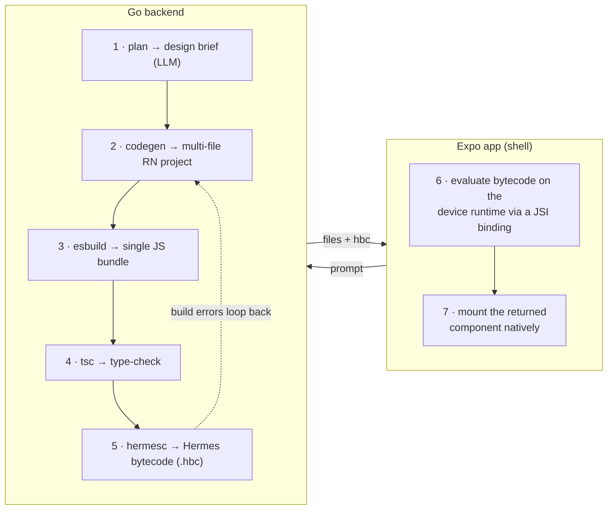
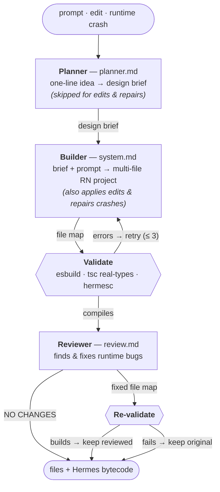

# VIBE — Voodoo Intelligence Build Engine

Describe an app in one sentence, get a real native app running on your phone.

You type *"I want a calculator"*, and a few seconds later a working React Native
calculator is mounted natively on the device — no Metro rebuild, no app store, no
reload. You can then keep chatting to edit it, and if it crashes, one tap sends the
error back to the model for a fix.

## How it works

There are two pieces: a **Go backend** that turns prompts into compiled app
bytecode, and an **Expo app** (the "shell") that runs that bytecode on device.



### Backend (`backend/`, Go)

An HTTP server (default port `1337`) that exposes the generation pipeline.

**`POST /api/v1/generate`** runs the pipeline in `internal/generator`:

1. **Plan** — a first LLM pass turns the one-line idea into a concrete design
   brief (concept, aesthetic, data source, layout). Non-fatal: if it fails, the
   build falls back to generating straight from the prompt.
2. **Code-gen** — the model emits a complete multi-file React Native project as a
   "file map" of `path` → `content`.
3. **Bundle** — `esbuild` bundles the project into one CommonJS module. Host
   modules (react, react-native, the SDK below) are left external; vendored
   pure-JS deps (zustand, date-fns) are inlined.
4. **Type-check** — `tsc` validates the project against the *real* SDK type
   definitions (see `typedeps/`), so calling a non-function, a missing export, or
   a wrong argument type is caught here instead of crashing on the device.
5. **Compile** — `hermesc` compiles the JS to **Hermes bytecode**, the format the
   device's JS engine runs directly.

If any step fails, the build error is fed back to the model and the loop retries,
up to `GENERATOR_MAX_ATTEMPTS` (default 3).

6. **Review** — once it compiles, a final model pass hunts for runtime bugs the
   compiler can't see (dead handlers, calling a non-function, bad SVG props) and
   returns a fixed project. The fix is re-validated and kept *only if it still
   builds*, so review can never make a working app worse. Toggle with
   `SELF_REVIEW` (default on).

The response carries the source files (for display and future edits) plus the
base64-encoded bytecode. A second endpoint, **`POST /api/v1/generate/stream`**,
runs the same pipeline but streams each stage as Server-Sent Events so the app
can show real progress (and the design brief) live instead of a fake spinner.

The same endpoint also handles **edits** (send the current `files` + a change
prompt) and **repairs** (send the current `files` + a runtime `error`).

#### The agents

The pipeline is really three sequential model passes — each with its own system
prompt in `internal/generator/prompts/` — wrapped around one deterministic
validation gate (esbuild · tsc · hermesc). Each agent hands a file map to the
next; the gate is what lets them fail fast and self-correct.



- **Planner** (`planner.md`) — the product designer. Turns the one-liner into a
  concrete build brief (concept, aesthetic, data source, layout) so the builder
  isn't improvising. Non-fatal and skipped for edits/repairs, where intent is
  already known.
- **Builder** (`system.md`) — the engineer. Writes the whole multi-file project,
  and is the agent that also applies edits and repairs on-device crashes. It loops
  with the validation gate: a build, type, or hermes error is fed back as a new
  message, up to `GENERATOR_MAX_ATTEMPTS`.
- **Reviewer** (`review.md`) — the QA pass. Reads the *compiled* project and fixes
  the runtime bugs types can't catch, then its output goes back through the gate
  and is adopted only if it still builds.

All three run on the same model — **Claude Sonnet 4.6** by default, or **Haiku**
when `DEV=true` (cheaper and faster for local iteration).

Other endpoints:
- **`POST /api/v1/eject`** — renders the generated file map into a full, buildable
  Expo project and returns it as a zip, ready for `eas build`.
- **`GET /health`**, **`GET /openapi.json`**, and API docs.

All model passes go through the `joakimcarlsson/ai` client (streaming, so large
generations aren't capped by the API's non-streaming limit), with OpenTelemetry
wired throughout.

### App (`app/`, Expo / React Native)

A single-screen Expo Router app that acts as a host shell for generated apps. It
has three phases: a landing prompt, a loading animation, and the result.

The clever bit is how a generated app actually runs. Rather than reloading Metro
with new source, the shell evaluates precompiled bytecode directly on the device:

- **`modules/vibe-hermes`** is a small native module that installs a JSI binding,
  `globalThis.__vibeEvalBytecode(base64)`, which evaluates Hermes bytecode on the
  running JS runtime.
- **`src/lib/load-generated.ts`** sets up `globalThis.__vibeRequire` — a tiny module
  shell exposing the host SDK (react, react-native, `@vibe/router`, async-storage,
  haptics, image-picker, location) — evaluates the bytecode, then reads back the
  component the bundle assigned to `globalThis.__VIBE_APP`.
- **`src/components/generated-app.tsx`** mounts that component inside an error
  boundary. A render crash, or an async error caught by the runtime trap, surfaces
  a **"Fix with AI"** button that ships the error back to `/generate` for a repair
  pass.
- **`src/lib/vibe-router.tsx`** is the pure-JS stack navigator (`@vibe/router`)
  that generated multi-screen apps use.

From the result screen you can **keep chatting** to edit the app (the current files
are sent back with your change) or **go home** to start over.

### The host SDK

Generated apps can only `import` from a fixed allow-list — the "host SDK". It's
defined once in `backend/internal/generator/host-sdk.json` (which feeds the model's
system prompt) and provided at runtime by the shell's `__vibeRequire`. The two
sides must agree: a module listed in the SDK must also be wired in
`load-generated.ts`. Current modules: `react`, `react-native`, `@vibe/router`,
`@react-native-async-storage/async-storage`, `expo-haptics`, `expo-image-picker`,
`expo-location`, `react-native-svg`, and `expo-linear-gradient`, plus the inlined
pure-JS libs `lucide-react-native` (icons), `zustand`, and `date-fns`.

## Running it

### Backend

Requires Go and a `hermesc` binary on `PATH` (from a Hermes build).

```sh
cd backend
cp .env.example .env      # set ANTHROPIC_API_KEY, point HERMESC_PATH at hermesc
go run ./cmd/api          # serves on :1337
```

| Variable | Default | Purpose |
| --- | --- | --- |
| `ANTHROPIC_API_KEY` | — | **Required.** Auth for the LLM. |
| `HERMESC_PATH` | `hermesc` | **Required.** Path to the `hermesc` binary. |
| `GENERATOR_MAX_ATTEMPTS` | `3` | Max generate→compile→retry cycles. |
| `DEV` | `false` | `true` uses Claude Haiku (cheap/fast); otherwise Sonnet 4.6. |
| `SELF_REVIEW` | `true` | Run the reviewer pass after a successful build. |
| `PORT` | `1337` | HTTP listen port. |

A `Dockerfile` and `docker-compose.yml` are also provided.

### App

Requires the Expo toolchain and an Android/iOS device or emulator. Because the app
ships a native module, it needs a dev build (not Expo Go).

```sh
cd app
npm install
npm run start            # android dev build; also adb-reverses 8081 + 1337
# or: npm run ios
```

Point the app at the backend with `EXPO_PUBLIC_API_URL` if it isn't on
`http://localhost:1337` (see `src/lib/api.ts`).

## Repository layout

```
backend/
  cmd/api/             server entrypoint
  internal/
    generator/         the prompt → bytecode pipeline (+ host-sdk.json)
      prompts/         the three agent prompts: planner.md, system.md, review.md
    httpx/             HTTP server, routes (incl. SSE), OpenAPI
    eject/             generated app → full Expo project zip
    config/ otel/      configuration and observability
  jsdeps/              pure-JS libs the bundler inlines (manifest tracked)
  typedeps/            real SDK type defs for the typecheck (manifest tracked)
app/
  src/
    app/index.tsx      the shell UI (landing / loading / result)
    components/         generated-app mount + error boundary
    lib/                bytecode loader, host-module shell, @vibe/router, api
  modules/vibe-hermes/  native JSI binding that evaluates bytecode on device
```
